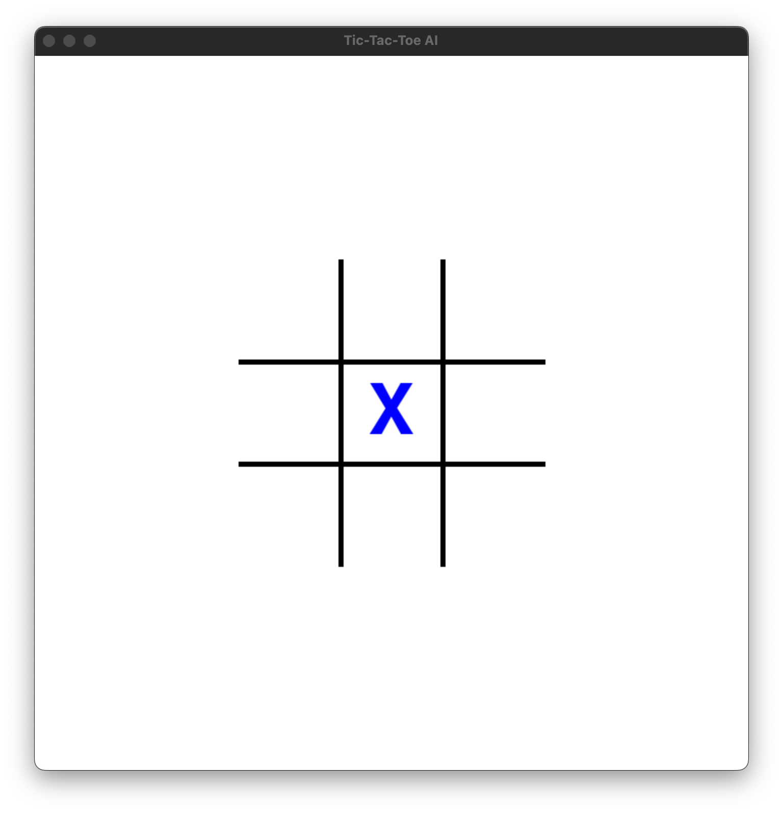
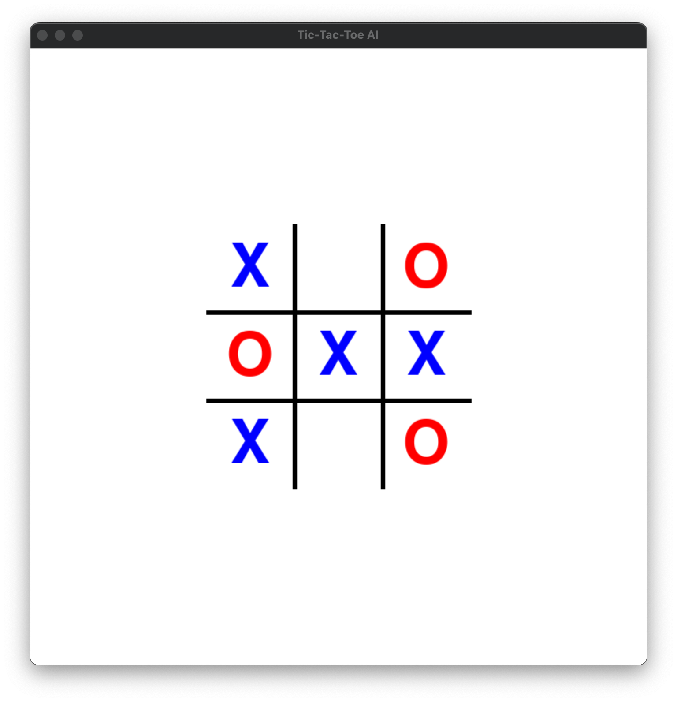
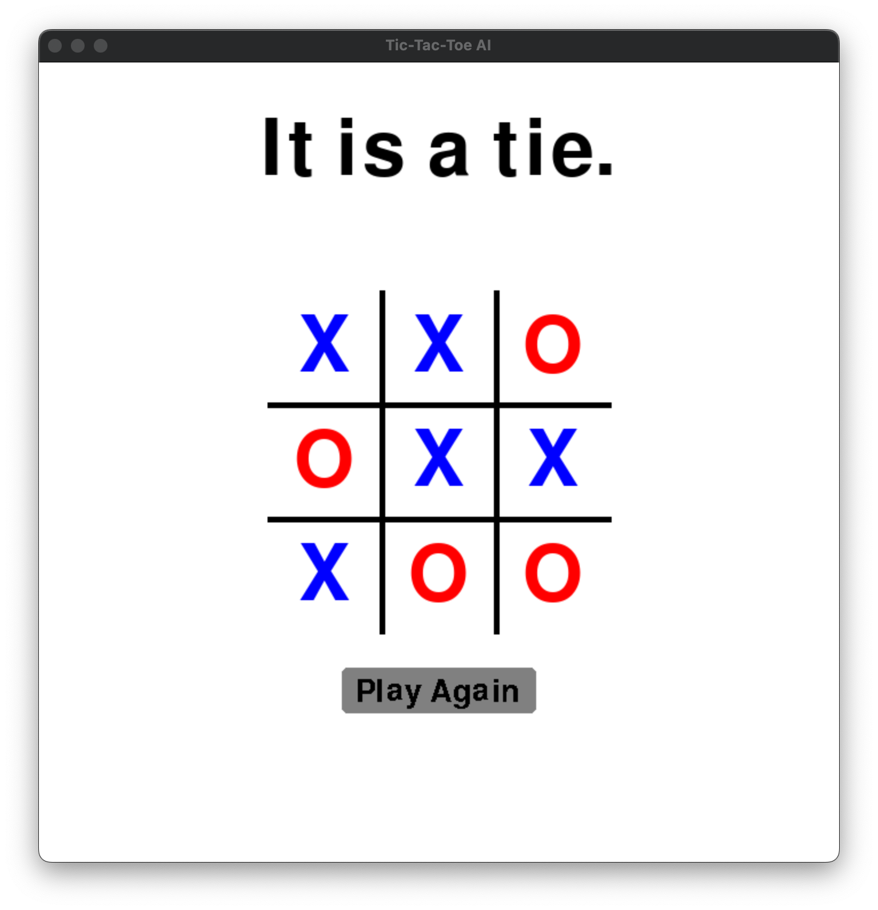
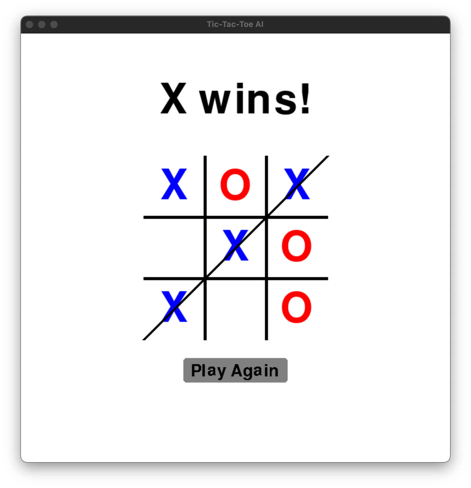

# Tic-Tac-Toe AI
> A Tic-Tac-Toe AI that uses the MinMax algorithm.

## Table of Contents
* [General Info](#general-information)
* [Technologies Used](#technologies-used)
* [Features](#features)
* [Screenshots](#screenshots)
* [Setup](#setup)
* [Usage](#usage)
* [Project Status](#project-status)
* [Room for Improvement](#room-for-improvement)
* [Contact](#contact)
<!-- * [Liceunnnse](#license) -->

## General Information
The program has two parts: the AI itself and the interface to display the game.

The AI was made using the MinMax algorithm that determines the best move to make by finding the maximum of the minimum heuristic scores for a given set of possible moves. This works in steps:
- For each possible ply for the computer
    - Check each possible ply for the player
        - Calculate the heuristic score by finding the difference of possible winning moves for computer and player
        - Find worst case move (min) for each ply
    - Find the best (max) of the worst case moves (min).

The interface was made using PyGame. It displays the symbols on the classic 3x3 grid. The player is able to make a move by clicking on a grid box. In the end, there is a play again button.

## Technologies Used
- Pygame - version 2.1.2
- Numpy - version 1.23.1

## Features
- AI is unbeatable
- Line for winner
- Play Again button
- Quick calculations by AI

## Screenshots

  
  

  
  

## Setup
Run setup.py to install requirements.

## Usage
Run main.py from the terminal.

## Project Status
Project is: _in progress_

## Room for Improvement
Room for improvement:
- Make MinMax algorithm calculate more layers of future moves.

To do:
- Make it possible to change computer's symbol from UI instead of changing code.

## Contact
- Created by @FirdavsN
- email: fnasridd@caltech.edu
